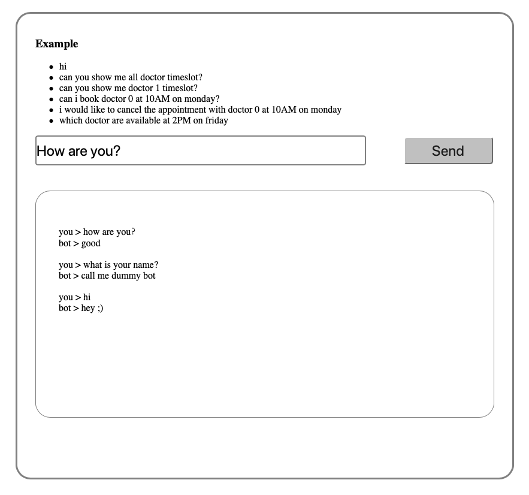
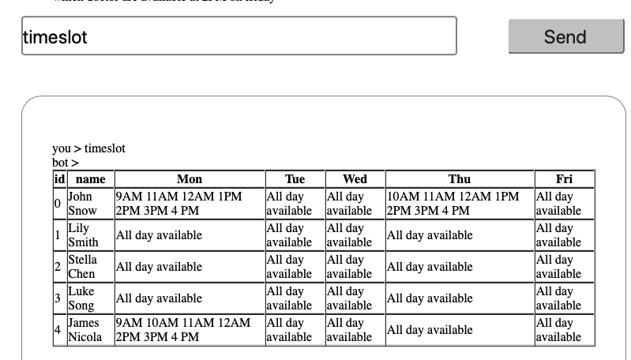
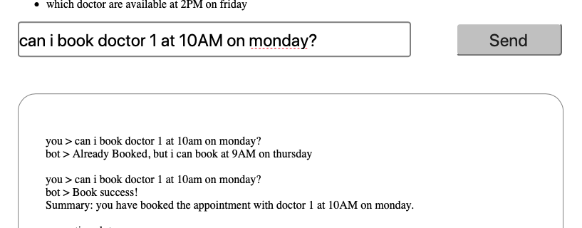
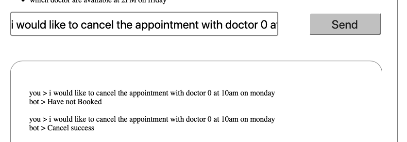
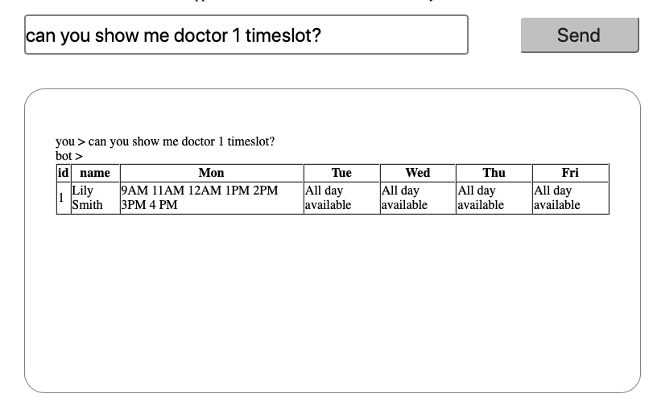

# 9322 Asst1 - Dentist Chatbot

##### Hao Fu - z5102511

## Prerequisite

----

- Docker is running -> [Install link](https://www.docker.com/products/docker-desktop)
- python3 is installed -> `brew install python3` (for MacOS)

## Run code

---

- Download zip file and unzip it

- `bash run.sh`

- Open web brower and type address `http://0.0.0.0:5002`

  (The dentist and timeslot server will run in separate docker container. Dentist server will run in `http://0.0.0.0:5000` and timeslot server will run in `http://0.0.0.0:5001`)

## API Documentation 

---

You can find the documtion in following link or you can find them in **doctor.yaml** and **timeslot.yaml** 

- [Doctor API Documentation](<https://app.swaggerhub.com/apis/lmcmz/dentist-booking/1.0>)

- [Timeslot API Documentation](https://app.swaggerhub.com/apis/lmcmz/timeslot/1.0)

  

## Functions
#### Basic greetings

---

You can send some basic greetings with chat bot. 

For example:

- hi

- How are you?

- What is your name?

  More detail on the following snapshot.

#### Provide doctors information 

---

You can get doctor information by asking following sentences. 

- Can you give me some information about doctors?

- Doctor info

  

  

#### List all the available doctors 

---

Send bot following instruction, it will reply with all doctor timeslot

- can you show me all doctor timeslot?
- give me all doctor timeslot
- timeslot

#### Make a appointment

---

You can send booking request in following format.

***can i book doctor {doctorId} at {time} on {day}?***

Example: `Can i book doctor 1 at 10AM on Monday?`

DoctorId are available in a range, which is same as doctor info. 

| name     | available value                              |
| -------- | -------------------------------------------- |
| doctorId | 0,1,2,3,4,5                                  |
| time     | 9AM, 10AM, 11AM, 12AM, 1PM, 2PM, 3PM, 4PM    |
| day      | Monday, Tuesday, Wednesday, Thursday, Friday |

If the time is booked, the chat bot will suggest another free time.

#### Cancel a appointment

---

You can cancel booking request in following format.

***i would like to cancel the appointment with doctor {doctorId} at {time} on {day}***

Example: `I would like to cancel the appointment with doctor 0 at 10AM on monday`

The available value is the same as booking.

#### Preferred doctor timeslot

----

Show a single doctor's timeslot. 

***Can you show me doctor {doctorId} timeslot?***

Example: `can you show me doctor 1 timeslot?`

