# COMP9322 - Asst2

##### Hao Fu | z5102511


## Graphic

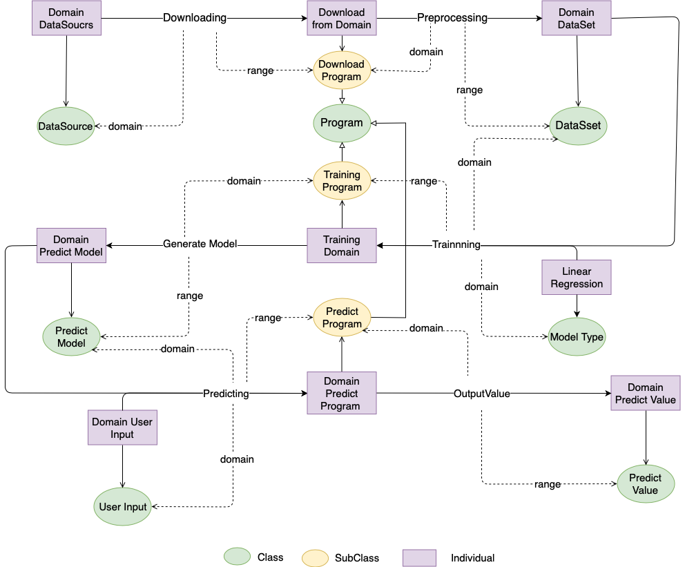


Here is a over view of the whole system. In the grahic, it using Domain as a example. Program use downloading module to download the datasource then it will preprocessing it to dataset. User can choose any mode type to train this dataset. After it was trained, it will preduce a predict model. User use the predict model as a blackbox. Input value in blackbox then it will make the prediction. Final predict value will show in the screen.


## Class

In this program, we assume the data source come from two place, **Domain** and **Realestate**. All the instance is base on those two datasource.


#### Program


In our system, there are 3 major modules of our program. 

- Downloading Module

  + As for download program, the major feature  is downloading the datasource from internet to our program.

  + > **Domain** Download Module
    >
    > **Realestate** Download Module

- Trainning Module 

  + The training program is use user selected dataset and model type as a input and produce the predict module as a output.

  + > **Domain** Training Module
    >
    > **Realestate** Training Module

- Predict Module

  + User enter the value which need to predict, then the predict will return a predit value according to this input.

  + > **Domain** Predict Module
    >
    > **Realestate** Predict Module

    

#### DataSource


It is the raw data from internet, program can not use it directly. It need to be filtered and preprocessing until it become a format data. 

Following is the instance:

> **Domain** Data Source
>
> **Realesatte** DataSource


#### Dataset

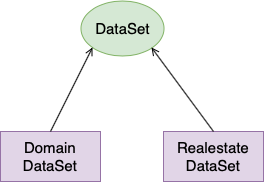

The data after formatting and filtering can be input as training resource.

Following is the instance:

> **Domain** Dataset
>
> **Realestate** Dataset


#### Model Type

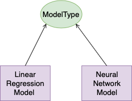


The training  method that user can selected. Currently, it support following method.

Following is the instance:

> **Linear Regression ** Model

> **Neural Network** Model


#### Predict Model

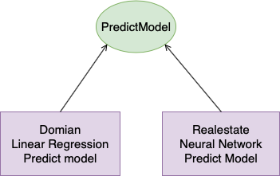

The model after training, program can use it to predict value in the furture.

Following is the instance:

> **Domian** Regression Model
>
> **Realestate** Nural Network Model


#### User Input

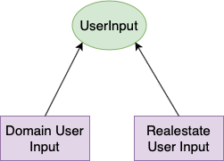

User input the value to predict the futhur value. For example, it could be the year in the furture.

It has following instance:

> **Domain** user input
>
> **Realestate** user input


#### Predict Value

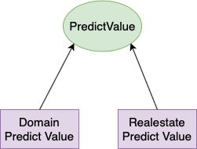

The final value output by predict program. It requires predict model and user input.


## Object Property & Instance

#### Downloading

It links the instance between DataSource and DownloadModule. For exmaple:

>  Domain Data Source ——>  Domain Download Module

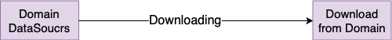


#### Preprocessing

The object property  connect the download module and dataset.

> Domain Download Module ——>  Domain Dataset

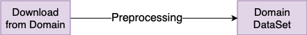


#### Training

The training is convert dataset and module to training program.

> Domain Dataset & Linear Regression Model type ——> Domain Training program 


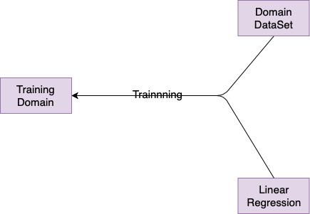


#### GenerateModel

Convert Training program to predict model

> Domian Training Program ——> Domain Predict model

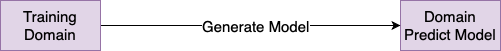


#### Predicting

It links domain predict model and user input to predict program.

> Domian User Input & Domain Predict model ——> Domain Predict program

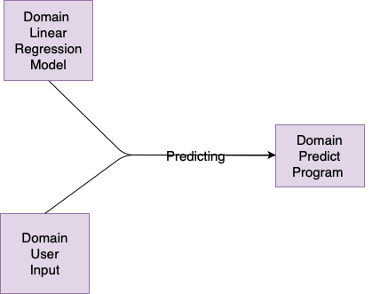


#### OutputValue

It show the final output and 

> Domain predict program ——> Domain Predict value

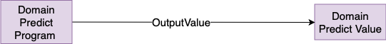


## Data Property

#### DataSource

- Time
- SourceURL
- Name
- Size


#### DataSet

- CreateTime
- Name
- Size


## Onto Graphic

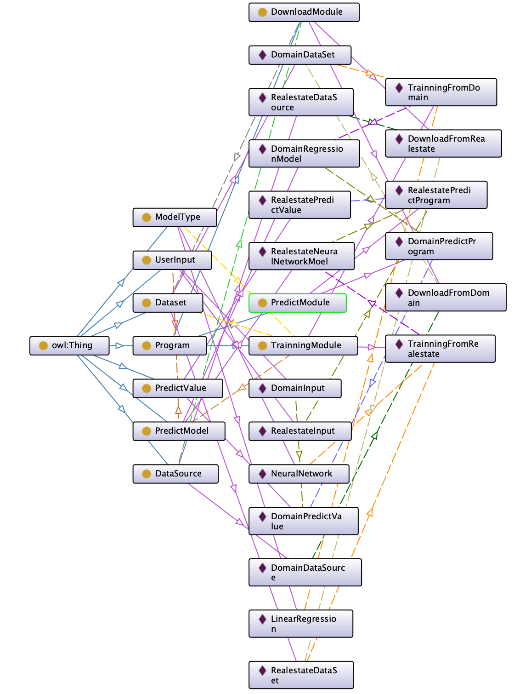


Here is the all onto view for the whole system. 


## Usercase 

#### All object in system

User want to find all the class, individuals and object property.

```SPARQL
PREFIX rdf: <http://www.w3.org/1999/02/22-rdf-syntax-ns#>
PREFIX owl: <http://www.w3.org/2002/07/owl#>
PREFIX rdfs: <http://www.w3.org/2000/01/rdf-schema#>
PREFIX xsd: <http://www.w3.org/2001/XMLSchema#>
SELECT * WHERE {
	?x rdf:type ?type 
}
```

The result show all the class, individuals and object property.

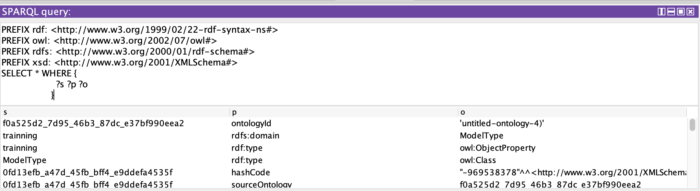


#### Find model type

User want to find the data type for the final predict value.

```SPARQL
SELECT ?modelType WHERE {
  ?x rdf:type :PredictValue.
  ?x :predicting ?predictModel.
  ?predictModel :training ?modelType.
}
```

The result should show: 

```
Linear Regression
```


####Create/Update  new datasource

User want to add or update new datasoucre. It need find which class should use to download data.

```SPARQL
SELECT ?predictValue ?downloadProgram WHERE {
  ?x rdf:type :PredictValue.
  ?x :predicting ?predictModel.
  ?dataset :training ?predictModel.
  ?downloadProgram :preprocessing ?dataset.
}
```

The result should show:

```SPARQL
DomainDownloadClass
```

